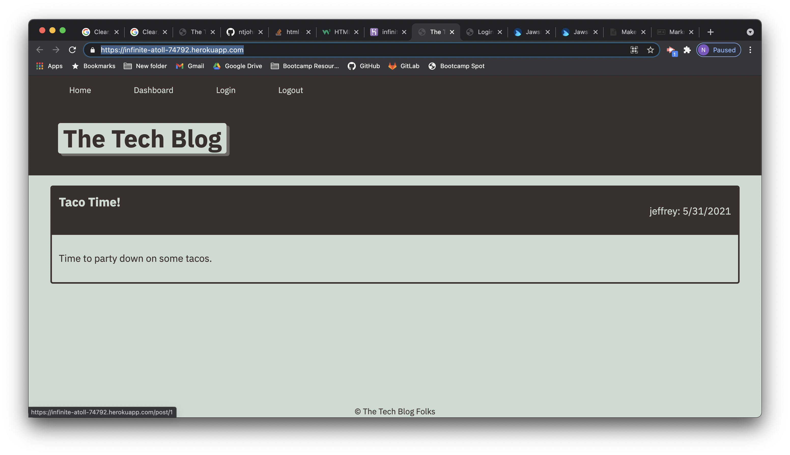

# Tech Blog

The Tech Blog is a place to discuss tech!

## Usage

[Deployed Link](https://infinite-atoll-74792.herokuapp.com/)
[GitHub](https://infinite-atoll-74792.herokuapp.com/)

## Contributing

[Nelson Johns](https://github.com/ntjohns1/)

Pull requests are welcome. For major changes, please open an issue first to discuss what you would like to change.

Please make sure to update tests as appropriate.

## Badges

 

 

 

 

---

## License

 

